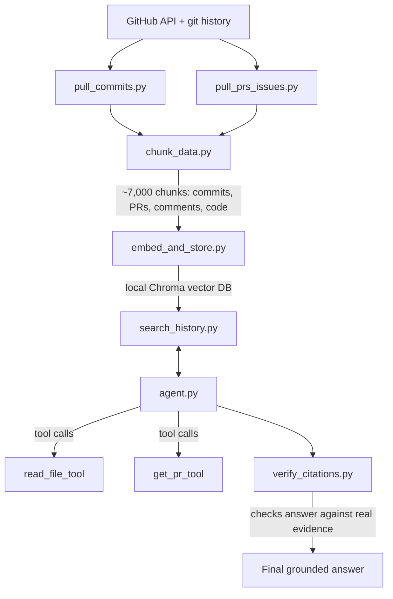

# Code Archaeologist

An AI agent that answers questions about the history of the `httpx` Python repository, with citations grounded in real commits, pull requests, and source code.

## The idea

When you're new to a codebase, you can't just ask "why does this function exist" and get an answer, you have to dig through commit history, old PRs, and discussions yourself. This project builds an agent that does that digging for you: it searches a repo's actual history, decides what to look at next based on what it finds, and answers with real citations instead of guessing.

## Architecture



## How it works

1. **`pull_commits.py`** — pulls commit history from `httpx` via pydriller (~1,500 commits)
2. **`pull_prs_issues.py`** — pulls PR history via the GitHub API (~1,800 PRs). httpx routes most bug reports through GitHub Discussions instead of Issues, so `issues.json` ends up empty, I found this out while testing and decided to move forward with PRs + commits as the main data source
3. **`chunk_data.py`** — splits commits, PR descriptions, PR comments, and the actual source code into ~7,000 searchable chunks. Source code is split by function/class using a simple regex-based splitter rather than a full parser like tree-sitter, a deliberate scope decision to keep things learnable as a first Python project
4. **`embed_and_store.py`** — turns every chunk into an embedding and stores it in a local Chroma vector database
5. **`search_history.py`** — semantic search over that vector store
6. **`agent_tools.py`** — three tools the agent can choose to use: `search_history_tool`, `read_file_tool`, `get_pr_tool`
7. **`agent.py`** — the actual agent loop. Given a question, the model decides on its own which tools to call, in what order, until it has enough to answer
8. **`verify_citations.py`** — a second, independent AI call that checks whether every claim in the agent's answer is actually backed by the evidence it gathered, instead of just trusting the first answer
9. **`run_eval.py`** — runs the agent against a hand-written set of 8 questions with known-correct answers, and grades each one

## Setup

Requires Python 3, plus these environment variables set:
- `GROQ_API_KEY` — from console.groq.com
- `GITHUB_TOKEN` — a GitHub personal access token with `public_repo` scope

Install dependencies:

​```
pip install -r requirements.txt
​```

Run the pipeline in order (each step depends on the previous one's output):

​```
python pull_commits.py
python pull_prs_issues.py
python chunk_data.py
python embed_and_store.py
​```

Then query the agent:

​```
python agent.py
​```

Or run the full eval:

​```
python run_eval.py
​```

## Example run

​```
QUESTION: Why was connection pooling implemented in httpx?

  [Agent is calling: search_history_tool({'query': 'connection pooling implementation reason'})]
  [Agent is calling: search_history_tool({'query': 'httpx connection pooling motivation'})]

FINAL ANSWER:
Connection pooling was implemented in httpx primarily to enable HTTP keep-alive,
allowing the client to reuse existing TCP connections for multiple requests rather
than establishing a new connection for each one.

Sources:
* PR #4: "Connection pooling"
* PR #624: "Connection pool refactoring"
​```

## Eval results

**7/8 correct**, graded by a separate AI acting as judge against known-correct answers and citations.

## Limitations

- **One eval miss**: asked which PR introduced the ability to disable timeouts entirely, the agent cited PR #493 instead of the correct PR #490. Both PRs are in the same timeout feature area, so the agent found the right general topic but picked an adjacent PR instead of the exact right one.
- **Source code chunking uses regex, not a real parser.** This works well on cleanly-formatted code like httpx's, but a real parser (tree-sitter) would handle edge cases like multi-line function signatures or decorators more reliably.
- **No GitHub Discussions support.** httpx routes most of its actual bug reports and Q&A through Discussions, which this project doesn't currently index.
- **Search is vector-only, no hybrid/keyword search or reranking.** A pure semantic search can occasionally miss exact identifiers (like a specific function name) that a keyword search would catch directly.
- **8-question eval set** is a solid first pass but small; a larger, more varied set would give a more reliable accuracy signal.

## Why I switched providers partway through (Gemini → Groq)

I originally built this on Google's Gemini API. It worked, but I kept running into a wall: Gemini's free tier daily quota for `gemini-2.5-flash` turned out to be just 20 requests a day, and since the agent loop makes multiple calls per question (research steps, tool calls, citation checking), I couldn't even get through one full eval run before hitting the limit.

I switched to Groq's free tier instead, which allows 30 requests/minute with no restrictive daily cap. This wasn't just a model name swap, Groq uses an OpenAI-style API rather than Gemini's, so I had to rewrite the message format in the agent loop, and manually write JSON tool schemas by hand since Groq can't auto-generate them from Python docstrings the way Gemini could. After switching, the full 8-question eval ran cleanly in one pass with zero rate limit errors.

## Other real decisions made along the way

- **Embeddings run locally**, not through an API. I originally tried Gemini's embedding API and hit both a per-minute and a per-day rate limit trying to embed ~7,000 chunks. Switched to `sentence-transformers` running entirely on my own machine, no API key, no limits, no cost.
- **Citation verification is a separate AI call**, not just a prompt instruction. The agent is told to cite sources, but nothing forces it to be accurate, so a second, independent call checks the final answer against the actual evidence gathered. In testing, this caught real issues, like the agent implying a specific file was the source of some logic when the evidence didn't clearly establish that.
- **Source code is included as searchable chunks**, not just commit/PR history. This means the agent can answer both "why did this change" questions and "show me the current implementation" questions from the same search step.

## What I learned

This was my first real Python project, coming from a Java/DSA background with zero prior Python experience. Some of the concepts that took real work to get comfortable with: indentation-based blocks instead of braces (and the bugs that come from getting it wrong), list/dict comprehensions, f-strings, and the whole idea of an agent loop where the model decides its own next action instead of following a fixed script.

The hardest part of this project wasn't the AI reasoning, it was retrieval and infrastructure: getting good chunks, handling multiple different rate limits across two different providers, and making sure the agent's citations could actually be trusted instead of just sounding confident.

## Possible next steps

- Add GitHub Discussions support, since that's where httpx's actual bug reports and Q&A live
- Upgrade source code chunking from regex to a real parser (tree-sitter) for more accurate function boundaries
- Build-failure mode: paste a failing build log, search history for similar past failures and fixes
- Expand the eval set beyond 8 questions
- Investigate the PR #493 vs #490 mix-up to improve retrieval precision